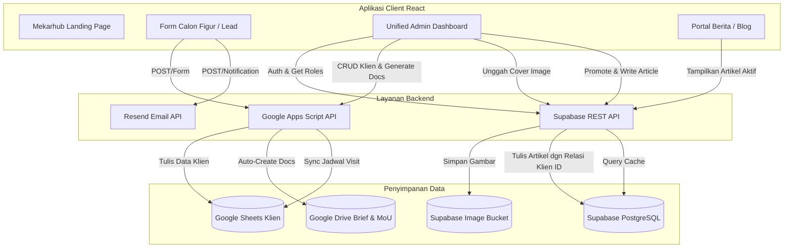
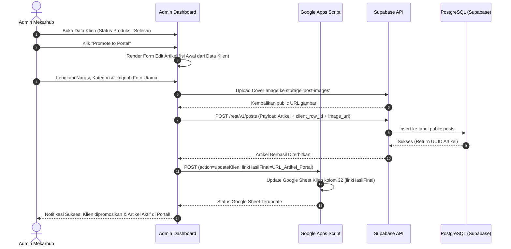

# PRODUCT REQUIREMENT DOCUMENT (PRD) & HASIL AUDIT TEKNIS
## UNIFIED MEKARHUB INTEGRATED PLATFORM (v1.0)
**Tanggal Audit & Dokumen:** 5 Juni 2026  
**Status Dokumen:** Final  
**Dibuat Oleh:** Antigravity (AI Senior Coding Assistant)

---

## 1. Abstraksi Eksekutif

**Mekarhub** saat ini beroperasi dengan dua sistem web terpisah di dalam repositori `mekar-web`:
1. **Mekarhub Web ([mekarhub](file:///d:/MEKARHUB/mekar-web/mekarhub))**: Landing page utama dan dashboard editorial klien yang digerakkan oleh **Google Sheets** & **Google Apps Script (GAS)**. Sistem ini menangani pendaftaran kolaborasi (lead), pengelolaan detail teknis (ide besar, visual tone, jadwal visit), dan otomatisasi pembuatan dokumen (Brief, MoU) di Google Drive.
2. **Portal Mekarhub ([portal-mekar](file:///D:/MEKARHUB/mekar-web/mekarblog/portal-mekar))**: Portal berita/blog digital modern yang didukung oleh **Supabase (PostgreSQL & Auth)** untuk mempublikasikan artikel dalam kategori Bisnis, Komunitas, Teknologi, dan Sosial.

### Hasil Audit Utama
Meskipun kedua sistem berfungsi dengan baik secara independen, terdapat **duplikasi data dan inkonsistensi proses**:
- **Proses Manual**: Admin harus menyalin atau mengetik ulang kisah klien dari dashboard Google Sheets di Mekarhub Web ke panel CMS Supabase di Portal Mekarhub untuk mempublikasikannya sebagai artikel publik.
- **Inkonsistensi Data**: Field editorial artikel (nama, judul, kategori, slug, narasi, cover image) disimpan secara paralel di spreadsheet figur (`SS_FIGUR_ID`) dan tabel database Supabase (`posts`), sehingga rentan terhadap perbedaan data.
- **Masalah Keamanan**: Dashboard admin Mekarhub Web masih menggunakan PIN statis (`mekarhub2026`) yang tersimpan di client-side code, sedangkan Portal Mekarhub sudah memiliki sistem autentikasi modern berbasis peran (Admin/Editor) di Supabase.

**Solusi Rencana**: Menyatukan kedua platform menjadi **Unified Mekarhub Integrated Platform** di mana data klien/lead dikelola di Google Sheets (untuk fleksibilitas workflow dokumen dan pelacakan lapangan), dan artikel yang dipromosikan disinkronisasikan langsung ke Supabase sebagai sumber kebenaran tunggal (*Single Source of Truth*) artikel publik, dilindungi oleh autentikasi terpusat Supabase.

---

## 2. Audit Teknis Sistem Saat Ini

Berikut adalah tabel matriks komparasi hasil audit mendalam kedua proyek:

| Dimensi Audit | Mekarhub Web ([mekarhub](file:///d:/MEKARHUB/mekar-web/mekarhub)) | Portal Mekarhub ([portal-mekar](file:///D:/MEKARHUB/mekar-web/mekarblog/portal-mekar)) |
| :--- | :--- | :--- |
| **Fokus Utama** | Manajemen Lead, Otomatisasi Dokumen (Brief, MoU), Pengelolaan Klien & Pelacakan Finansial. | Media Publikasi Artikel, Blog Konten Kategori, CMS Penulisan & Gambar. |
| **Database / CMS** | Google Sheets (`1dGr...` & `18iG...`) | Supabase PostgreSQL (`public.posts`) |
| **Backend / API** | Google Apps Script (v5.6 - Unified Production) | Supabase Serverless REST API |
| **Autentikasi** | Client-Side PIN Protection (`mekarhub2026`) | Supabase Auth (Admin & Editor Roles) |
| **Media Storage** | Google Drive & Link Pihak Ketiga (ImgBB) | Supabase Storage (`post-images` bucket) |
| **Otomatisasi** | Autogenerate Google Docs (Brief & MoU) via template, Sync Jadwal Visit. | Tidak ada. |
| **Integrasi Luar** | Resend API (Notifikasi Email), OG Proxy (Vercel Serverless Function). | Supabase Auth Client. |

### Detail Implementasi Google Apps Script (v5.6)
Sistem backend GAS saat ini mendukung operasi CRUD pada spreadsheet klien dan figur dengan detail kolom sebagai berikut:
- **Klien Spreadsheet (`SS_KLIEN_ID`)**:
  - Kolom 2: Nama
  - Kolom 3: Jabatan
  - Kolom 4: WhatsApp (dengan trigger langsung `wa.me` nomor terformat)
  - Kolom 16: Link Dokumen Brief (Dihasilkan secara otomatis dari `BRIEF_TEMPLATE_ID`)
  - Kolom 22: Link Dokumen MoU (Dihasilkan secara otomatis dari `MOU_TEMPLATE_ID`)
  - Kolom 26: Status Pelunasan (Nilai: `Lunas` / `Belum`)
  - Kolom 30: Jadwal Visit (Dengan fungsi format tanggal bahasa Indonesia: `Senin, 25 Mei 2026`)
  - Kolom 31: Status Produksi (`Proses`, `Tunda`, `Selesai`)
- **Figur Spreadsheet (`SS_FIGUR_ID`)**:
  - Kolom 7: Slug
  - Kolom 8: Narasi
  - Kolom 10: Image URL (Dengan parser tautan Drive `lh3.googleusercontent.com` untuk preview browser)
  - Kolom 11: ID Relasi Klien (Kunci asing ke baris klien)

### Detail Skema Database Supabase (`portal-mekar`)
Tabel `public.posts` pada Supabase menggunakan kolom sebagai berikut:
```sql
CREATE TABLE public.posts (
  id UUID NOT NULL DEFAULT gen_random_uuid() PRIMARY KEY,
  title TEXT NOT NULL,
  content TEXT NOT NULL,
  image_url TEXT,
  category TEXT NOT NULL DEFAULT 'bisnis',
  slug TEXT NOT NULL UNIQUE,
  excerpt TEXT,
  status TEXT NOT NULL DEFAULT 'published' CHECK (status IN ('draft', 'published')),
  author_id UUID REFERENCES auth.users(id) ON DELETE SET NULL,
  created_at TIMESTAMP WITH TIME ZONE NOT NULL DEFAULT now(),
  updated_at TIMESTAMP WITH TIME ZONE NOT NULL DEFAULT now(),
  published_at TIMESTAMP WITH TIME ZONE DEFAULT now()
);
```
Dilengkapi dengan RLS (Row Level Security) yang membatasi hak akses berdasarkan role pengguna di JWT token (`auth.jwt() -> 'app_metadata' ->> 'role'`):
- **Admins**: Memiliki kontrol penuh (Read, Write, Delete).
- **Editors**: Memiliki hak tulis dan edit (Read, Write), namun tidak dapat menghapus artikel.
- **Public**: Hanya dapat melihat artikel dengan status `published`.

---

## 3. Analisis Kesenjangan & Tantangan

1. **Inkonsistensi Hubungan Data Klien-Artikel**:
   - Jika admin menekan tombol "Promote to Figur" di dashboard Mekarhub Web, data baru ditambahkan ke spreadsheet figur. Namun, artikel tersebut tidak masuk ke database Supabase. Portal berita tidak mengetahui adanya artikel baru tersebut hingga dimasukkan secara manual.
2. **Duplikasi Manajemen Aset Gambar**:
   - Sistem GAS mencoba membaca gambar dari Google Drive atau ImgBB. Beberapa tautan Drive diblokir oleh Google karena masalah pembatasan unduhan langsung.
   - Portal Mekarhub mengunggah gambar dengan aman ke bucket Supabase `post-images`. Terdapat inkonsistensi cara penyimpanan dan resolusi URL gambar.
3. **Celah Keamanan PIN**:
   - Halaman `/admin` di Mekarhub Web hanya dilindungi oleh PIN `mekarhub2026` di level React state. Siapa pun dapat mengakses API endpoint GAS jika mereka membuka developer tools dan menyalin `VITE_GAS_ENDPOINT`.
4. **Perbedaan Skema Konten**:
   - Di database Supabase, artikel bertipe `posts` dengan field `title`, `content`, `excerpt`.
   - Di spreadsheet figur, artikel bertipe `figur` dengan field `nama` (sebagai nama figur), `judul` (sebagai judul artikel), `narasi` (sebagai isi artikel), dan `kategori`.

---

## 4. Target Arsitektur Sistem Baru (Unified Platform)

Untuk menyelesaikan tantangan di atas, kami merekomendasikan **arsitektur hibrida tersinkronisasi**:

### A. Alur Kerja Sistem Integrasi
1. Pendaftaran Kolaborasi masuk dari halaman publik Mekarhub Web ke Google Sheets via GAS.
2. Admin mengelola lead di Dashboard Klien, menghasilkan Brief & MoU, dan menentukan jadwal kunjungan lapangan.
3. Setelah produksi video & tulisan selesai, admin menekan tombol **"Promote to Portal"** (menggantikan "Promote to Figur").
4. Tombol ini akan membuka form penyusunan artikel yang terhubung langsung ke **Supabase API** (menggunakan Supabase Client) daripada menulis ke Google Sheets Figur.
5. Gambar artikel diunggah ke Supabase Storage, dan artikel disimpan langsung di tabel `posts` Supabase dengan field `id_relasi_klien` sebagai tautan pelacakan.
6. Portal Mekarhub mengambil data artikel secara dinamis dari Supabase. Tidak ada lagi data artikel di Google Sheets.

### B. Hubungan Antar Komponen (System Architecture)



### C. Alur Data Promosi Klien Menjadi Artikel Portal



---

## 5. Spesifikasi Teknis Integrasi

### A. Skema Database Supabase Baru
Untuk menghubungkan artikel dengan data klien yang ada di Google Sheets, tabel `posts` di Supabase harus diperluas untuk menyimpan referensi relasi klien.

```sql
-- Tambahkan kolom relasi klien ke tabel posts
ALTER TABLE public.posts 
  ADD COLUMN IF NOT EXISTS client_row_id INTEGER,
  ADD COLUMN IF NOT EXISTS is_featured BOOLEAN DEFAULT false;

-- Tambahkan indeks pencarian untuk relasi klien agar pencarian data cepat
CREATE INDEX IF NOT EXISTS posts_client_row_idx ON public.posts (client_row_id);
```

### B. Pemetaan Field Klien ke Artikel Portal
Saat mempromosikan klien menjadi artikel, dashboard akan memetakan data spreadsheet secara otomatis ke form artikel sebelum dipublikasikan:

| Kolom Spreadsheet Klien | Field Database Supabase (`posts`) | Rationale / Catatan |
| :--- | :--- | :--- |
| `idBaris` | `client_row_id` | Foreign key referensi baris klien di Google Sheets. |
| `nama` | `title` (Nama Klien + Brand) | Judul artikel akan otomatis digenerate: *"Kisah Inspiratif [Nama]: [Ide Besar]"*. |
| `ideBesar` | `excerpt` | Ide besar klien dijadikan kutipan ringkasan artikel. |
| `deskripsiUsaha` + `momenBerkesan` | `content` | Digabungkan secara otomatis dengan spasi paragraf sebagai draf isi artikel awal. |
| *Input Admin* | `slug` | Dibuat otomatis dari judul menggunakan fungsi `slugify()` di frontend. |
| *Input Upload File* | `image_url` | Gambar diunggah langsung ke storage Supabase, bukan lagi menyimpan link eksternal Drive. |
| `kategori` | `category` | Dipetakan ke kategori portal: `bisnis`, `komunitas`, `teknologi`, `sosial`. |

### C. Peningkatan Keamanan Dashboard Admin
Akses halaman admin di `d:\MEKARHUB\mekar-web\mekarhub` harus menggunakan sistem login berbasis **Supabase Auth** untuk menghilangkan celah keamanan PIN statis.

1. **Instalasi Supabase Client** pada project `/mekarhub`:
   ```bash
   npm i @supabase/supabase-js
   ```
2. **Implementasi Autentikasi**:
   - Jika pengguna mengakses `/admin`, periksa sesi aktif Supabase Auth.
   - Gunakan fungsi `current_editor_role()` untuk memastikan role user adalah `admin` atau `editor`.
   - Simpan token JWT Supabase di memori / state lokal untuk mengotorisasi request.
   - Hapus kode PIN `mekarhub2026` sepenuhnya dari aplikasi.

---

## 6. Rencana Implementasi & Rilis

Kami membagi rencana penyatuan ini menjadi 3 Milestones utama untuk meminimalisir risiko kegagalan operasional:

### Milestone 1: Setup Supabase Integration & Security (Minggu 1)
- [ ] Integrasikan `@supabase/supabase-js` ke dalam project `mekarhub` (Landing Page & Dashboard).
- [ ] Buat halaman login admin baru menggunakan Supabase Auth (menggantikan modal input PIN).
- [ ] Tambahkan kolom `client_row_id` dan `is_featured` di skema tabel Supabase `posts`.
- [ ] Konfigurasikan file `.env.local` dengan kredensial Supabase.

### Milestone 2: Fitur Promosi Artikel & Upload Media (Minggu 2)
- [ ] Desain antarmuka modal "Promote to Portal" di dashboard admin klien.
- [ ] Implementasikan integrasi unggah gambar ke Supabase Storage `post-images` dari dashboard klien.
- [ ] Buat API handler di frontend klien untuk menulis langsung ke Supabase `posts` saat artikel dipromosikan.
- [ ] Perbarui skrip Google Apps Script untuk menerima URL hasil final dari Portal dan menyimpannya di Google Sheets Kolom 32 (`linkHasilFinal`).

### Milestone 3: Migrasi Data & Pembersihan Sistem Lama (Minggu 3)
- [ ] Ekspor data figur lama dari `SS_FIGUR_ID` ke format JSON/CSV.
- [ ] Jalankan skrip migrasi untuk memasukkan artikel lama ke tabel `posts` Supabase (menghubungkan dengan ID klien jika ada).
- [ ] Hapus ketergantungan sheet figur (`SS_FIGUR_ID`) dari dashboard klien dan kode Google Apps Script.
- [ ] Lakukan verifikasi build akhir dan uji coba pengiriman notifikasi email Resend.

---

## 7. Kebutuhan Konfigurasi Environment (.env)

Untuk menjalankan platform terpadu ini, pastikan variabel lingkungan berikut diisi dengan benar di server staging maupun production:

### Konfigurasi Frontend (`mekarhub/.env.local`)
```env
# Google Apps Script & Sheets
VITE_GAS_ENDPOINT=https://script.google.com/macros/s/AKfycbxWKKBQxnUg3FHtwWw2H56fGp3JyHS3bNlHBj006v3yFvYu4cN5JD_TeIJBf52VMUJI0g/exec
VITE_SHEET_CSV_URL=https://docs.google.com/spreadsheets/d/e/2PACX-1vRGUQncFJ_ZU-dyfIeIuE1UZUbeLD_xozDKMLdFHjHE78lMsCPuUk20t7VoUhPIb5PzCiHXy0aFsAvo/pub?output=csv

# Supabase Integration (Diperlukan untuk login admin & publikasi artikel)
VITE_SUPABASE_URL=https://your-supabase-project-id.supabase.co
VITE_SUPABASE_ANON_KEY=your-supabase-anonymous-key-here

# Serverless API Configs (Tidak terlihat oleh browser)
SITE_BASE_URL=https://mekarhub.id
RESEND_API_KEY=re_your_resend_api_key
ADMIN_NOTIFICATION_EMAIL=mekarhub@gmail.com
RESEND_FROM_EMAIL=Mekarhub <onboarding@resend.dev>
```

---

## 8. Kesimpulan & Langkah Berikutnya

Melalui audit ini, kita telah memetakan struktur internal platform Mekarhub dan merancang jalur integrasi yang aman dan efisien antara pengelolaan klien berbasis Google Sheets dan portal publikasi konten berbasis Supabase. 

Penyatuan ini akan menghemat waktu administrasi editorial hingga **80%** dengan memotong alur salin-tempel manual, meningkatkan keamanan panel admin secara drastis, serta memastikan integritas data kisah inspiratif Mekarhub tetap terjaga dengan baik.

> [!TIP]
> **Rekomendasi Tindakan Cepat**: Gunakan slash command `/grill-me` jika Anda ingin mendiskusikan lebih lanjut detail penjadwalan migrasi Supabase atau penyesuaian otentikasi admin.

---
*Mekarhub Integrated System — Hasil Audit & PRD Final 2026.*
